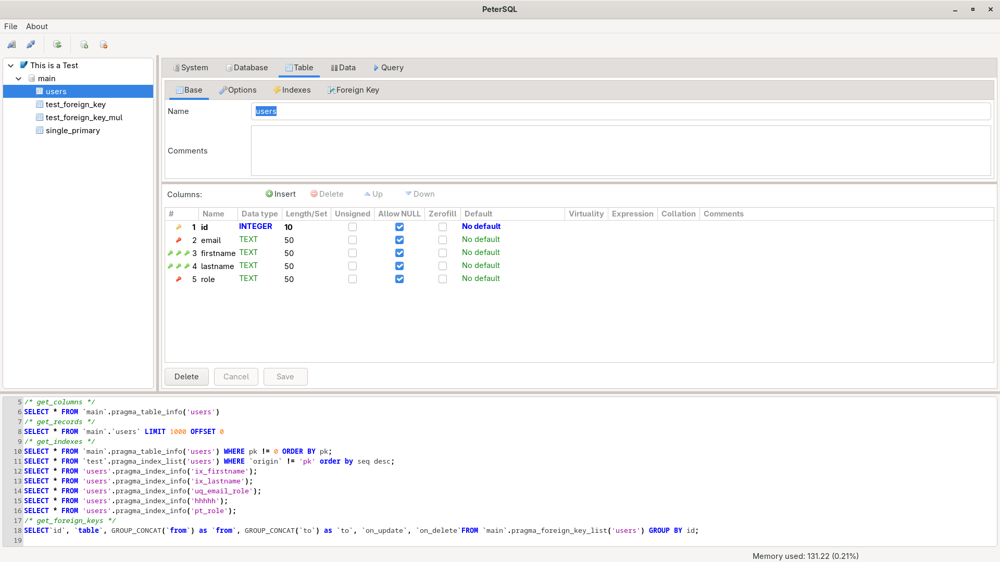
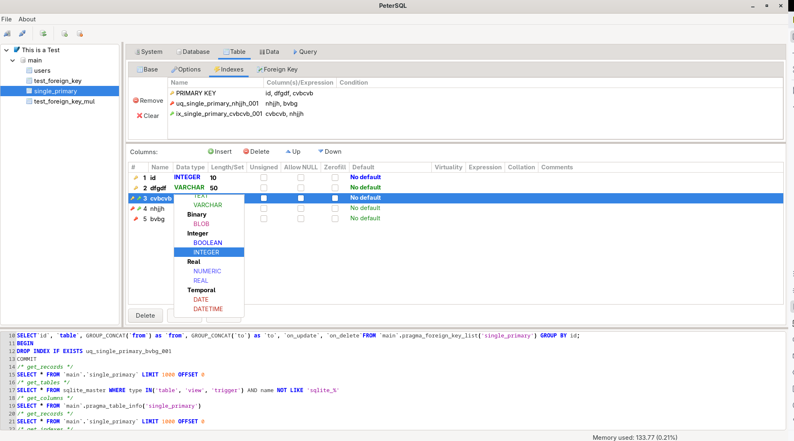
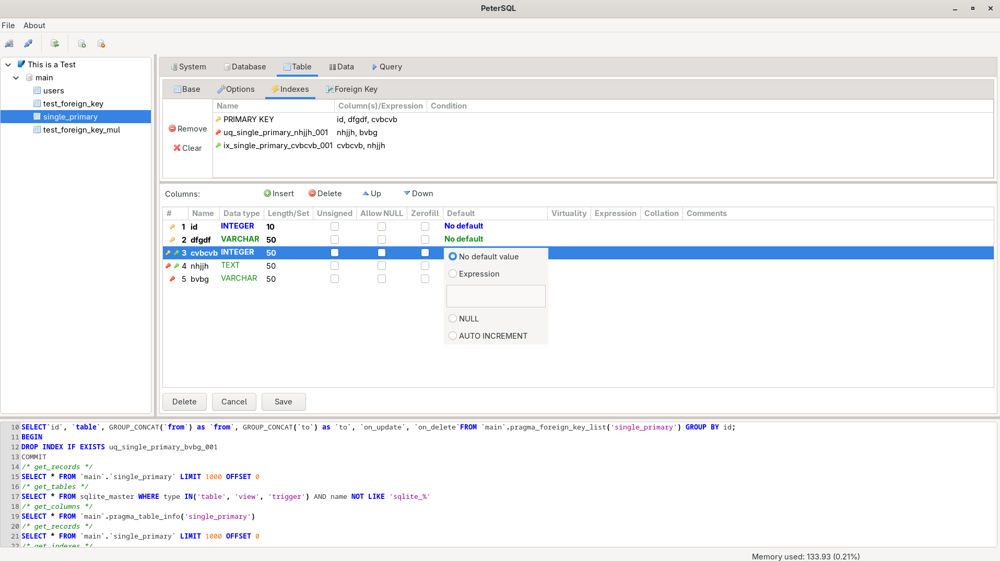
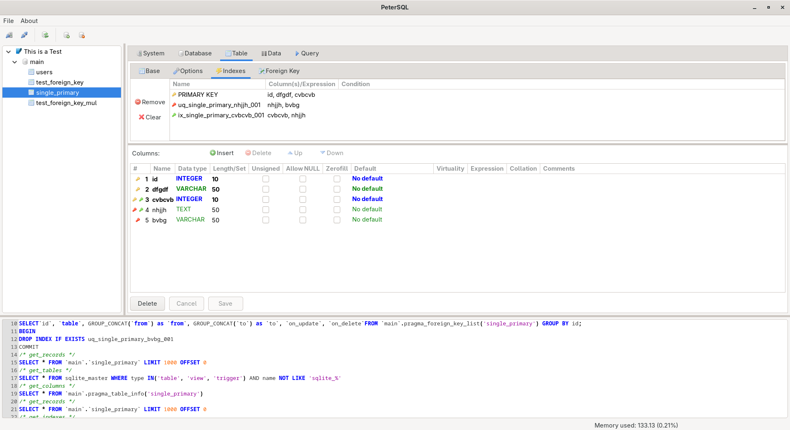
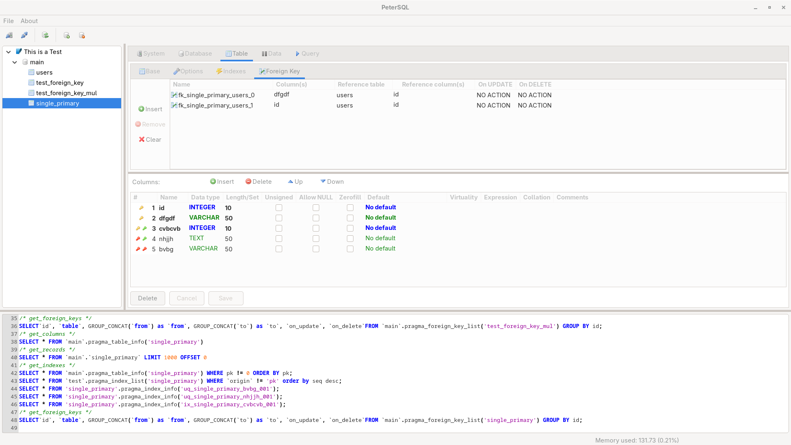
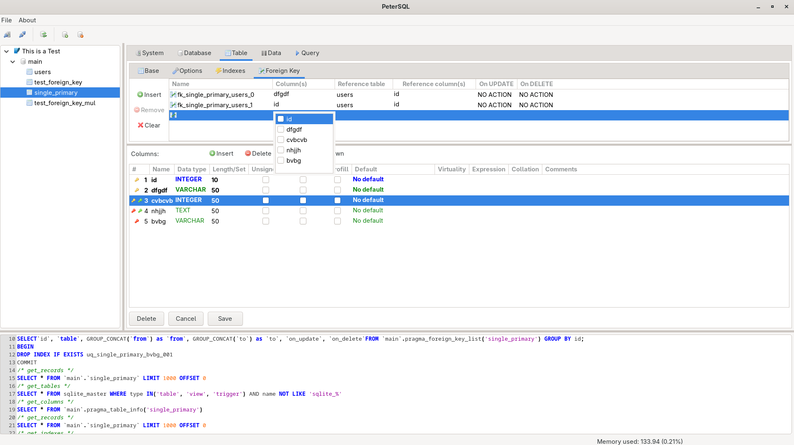

# PeterSQL
<p align="center">
  
</p>

> Heidi's (silly?) friend - a wxPython porting of HeidiSQL


**PeterSQL** is a graphical client for database management, inspired by the
excellent [HeidiSQL](https://www.heidisql.com/), but written entirely in **Python** with **wxPython**, and designed to
run natively on **All OS**.

---

## ⚠️ Project Status

PeterSQL is currently under active development.  
The project is **not finished** and should be considered **unstable**.

Features may be incomplete, change without notice, or break between versions.  
Use at your own risk and **do not rely on this project in production environments** yet.

---

## 🧭 Why PeterSQL?

Over the years, I have used **HeidiSQL** as my primary tool for working with MySQL, MariaDB, SQLite, and other
databases. It is a tool that I greatly appreciate: **streamlined**, **intuitive**, **powerful**.

So, as a personal challenge, I decided to port it to Python.

- ✅ An interface similar to HeidiSQL
- ✅ A *simple* and *clean* DB client like HeidiSQL
- ✅ A free and open source project, extensible in Python

---

## 🔧 Technologies used

- [Python 3.11+](https://www.python.org/)
- [wxPython 4.2.4](https://wxpython.org/) - native cross-platform interface
- [wxFormBuilder 4.2.1](https://github.com/wxFormBuilder/wxFormBuilder) - for the construction of the interface
---

## 🚀 Installation

PeterSQL uses [uv](https://github.com/astral-sh/uv) for fast and reliable dependency management.

### Prerequisites

- Python 3.11+
- uv (install with: `curl -LsSf https://astral.sh/uv/install.sh | sh`)

### Setup

1. Clone the repository:
   ```bash
   git clone https://github.com/gtripoli/petersql.git
   cd petersql
   ```

2. Install dependencies (including dev tools for testing):
   ```bash
   uv sync --group dev
   ```

3. Run the application:
   ```bash
   uv run python main.py
   ```

### Development

For production deployments, install only functional dependencies:
```bash
uv sync
```

To run tests:
```bash
uv run --group dev pytest
```

To run mypy:
```bash
uv run --group dev mypy
```

## 📸 Screenshot
<p align="center">
  
  
  
  
  
  
  
</p>