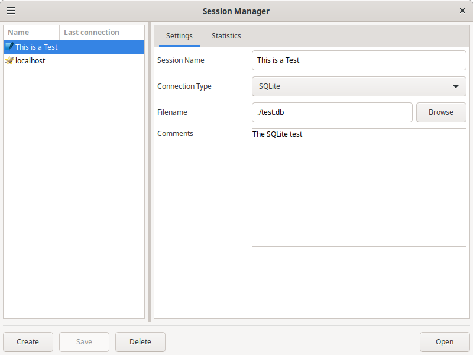
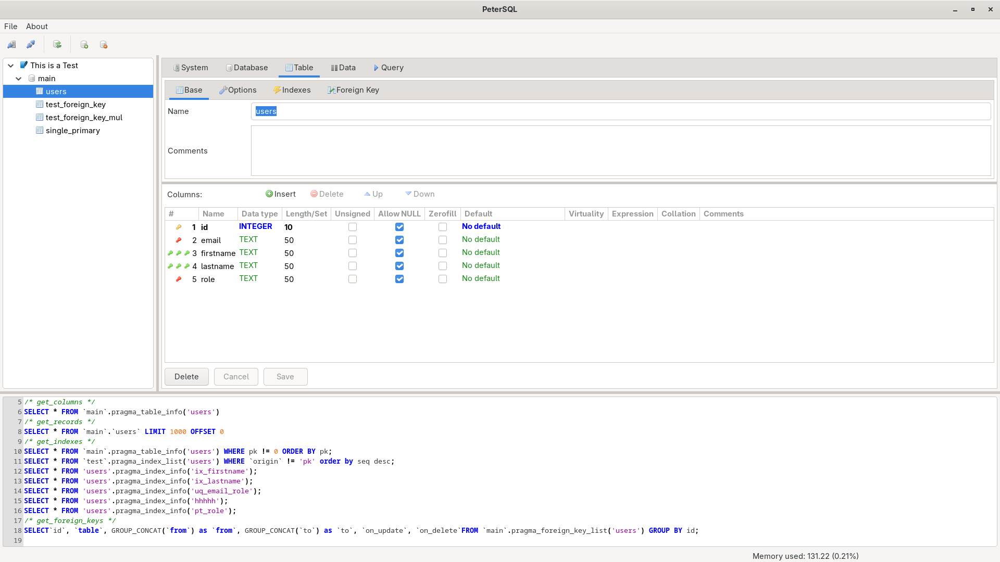
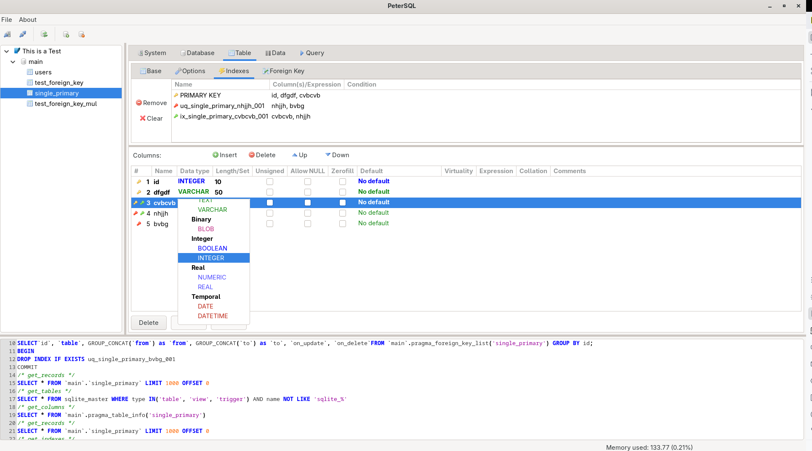
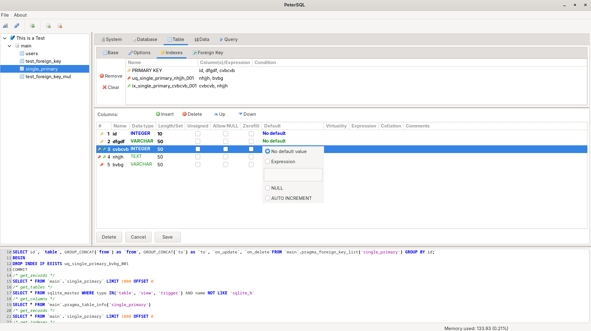
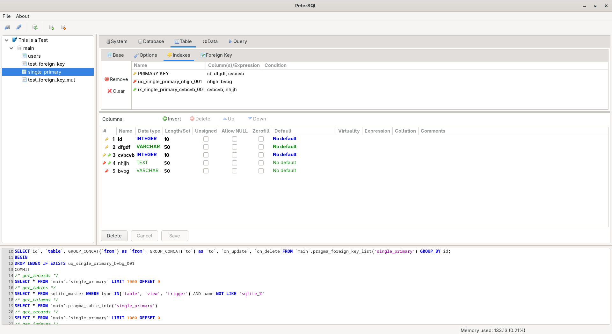
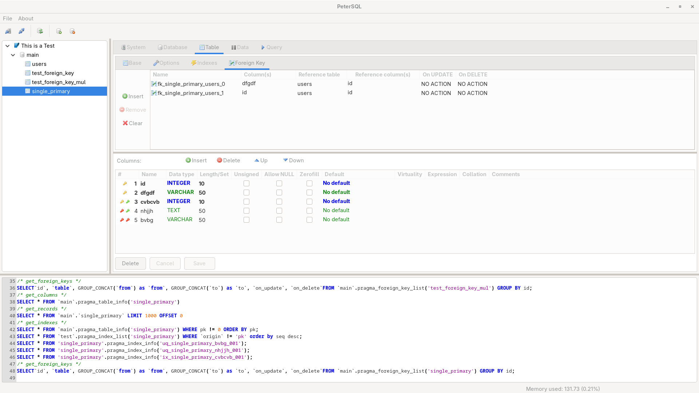
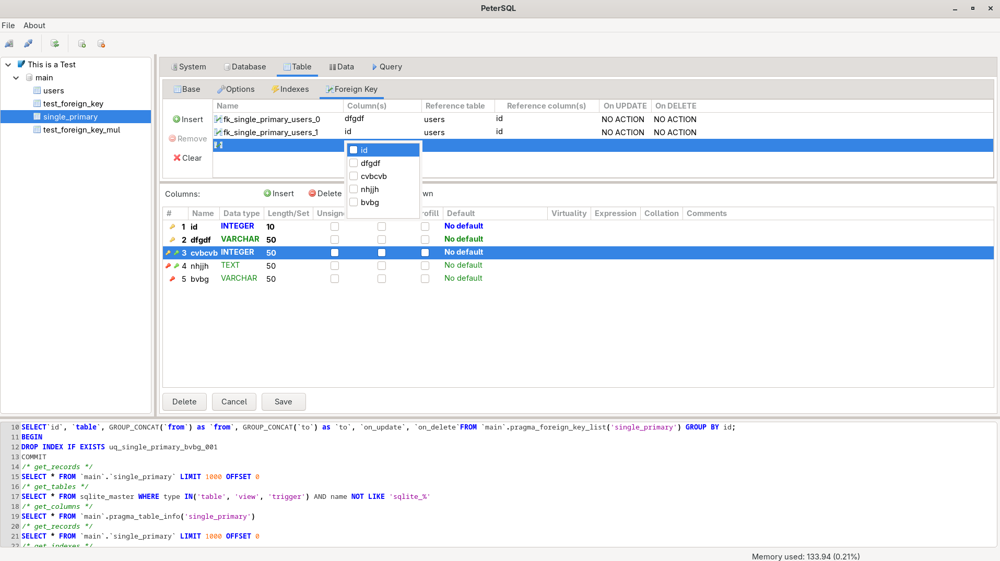

# PeterSQL

<p align="center">
  
</p>

> Inspired by HeidiSQL — reimagined in pure Python.

**PeterSQL** is a graphical client for database management, inspired by the
excellent [HeidiSQL](https://www.heidisql.com/), but written entirely in **Python**
using **wxPython**, with a focus on portability, extensibility, and native look & feel.

PeterSQL is **not a clone and not a port** of HeidiSQL.
It shares the same spirit — clarity, speed, practicality — but follows its own
path as a Python-native project.

---

## ⚠️ Project Status

The project is in **active development** and currently unstable.
Features may be incomplete or change without notice.

Use at your own risk and **do not rely on this project in production environments** yet.

For a detailed status snapshot, see:

- [PROJECT_STATUS.md](PROJECT_STATUS.md)

### Recent updates
 
 - Connection passwords are now stored securely via system keyring using per-connection UUIDs instead of plaintext YAML.
 - SQL autocomplete extended to INSERT / UPDATE / DELETE and string literals; parser improved with JSON and multi-table coverage.
 - Table execution flow updated in the records UI.
 - `row_format` and `convert_data` options added to the MySQL/MariaDB table editor.
 - `windows/main/` modules restructured into subdirectories (`database/`, `table/`, `query/`).
 - Advanced cell editor replaced with a dedicated `ColumnContentDialog` for large content.
 - Added stored function support with deterministic flag handling for MySQL and MariaDB engines.
---

## 🧭 Why PeterSQL?

For years, I have used **HeidiSQL** as my primary tool for working with
MySQL, MariaDB, SQLite, and other databases.
It is streamlined, intuitive, and powerful.

PeterSQL started as a personal challenge:
to recreate that same *spirit* in a **pure Python** application.

But PeterSQL is not meant to be a 1:1 replacement.

Where HeidiSQL is Delphi-based and Windows-centric,
PeterSQL is:

- 🐍 **Written entirely in Python**
- 🧩 **Easily modifiable and extensible**
- 🌍 **Cross-platform**
- 🎯 **Focused on clarity and simplicity**
- 🆓 **Free and open source**

PeterSQL aims to feel natural for developers who live in the Python ecosystem
and appreciate lightweight, practical tools.

---

## 🔭 Vision

PeterSQL is evolving beyond a simple SQL client.

Planned directions include:

- 🧠 Smarter, scope-aware SQL autocomplete
- 📊 Visual schema / diagram viewer (inspired by tools like MySQL Workbench)
- 🔌 Extensible architecture for future tooling
- 🐍 Better integration with Python-based workflows

The goal is not to replicate existing tools,
but to build a Python-native SQL workbench with its own identity.

---

## 🔧 Technologies used

- [Python 3.14+](https://www.python.org/)
- [wxPython 4.2.5](https://wxpython.org/) - native cross-platform interface
- [wxFormBuilder 4.2.1](https://github.com/wxFormBuilder/wxFormBuilder) - UI construction

---

## 🌍 Available Languages

PeterSQL supports the following languages:

- 🇺🇸 **English** (en_US)
- 🇮🇹 **Italiano** (it_IT)
- 🇫🇷 **Français** (fr_FR)
- 🇪🇸 **Español** (es_ES)
- 🇩🇪 **Deutsch** (de_DE)

You can change the language in the application settings (Settings → General → Language).

---

## 🧪 Test Coverage

PeterSQL has a structured test suite with both **unit tests** and **integration tests** across supported database engines.

- 🏗️ **Granular base class architecture** - zero code duplication
- 🐛 **Bug detection** - tests have found multiple API inconsistencies
- ✅ **Full CRUD coverage** for core database objects

For detailed test coverage matrix, statistics, and architecture, see **[tests/README.md](tests/README.md)**.

<!-- SUITE_BADGES_START -->
### Suite status (passed / skipped)

| Suite | Passed | Skipped |
|-------|--------|---------|
| autocomplete |  |  |
| core |  |  |
| ui |  |  |
| mysql |  |  |
| mariadb |  |  |
| postgresql |  |  |
| sqlite |  |  |

<!-- SUITE_BADGES_END -->

---

## 🚀 Installation

PeterSQL uses [uv](https://github.com/astral-sh/uv) for fast and reliable dependency management.

### Prerequisites

- Python 3.14+
- uv (install with: `curl -LsSf https://astral.sh/uv/install.sh | sh`)

### Setup

1. Clone the repository:
   ```bash
   git clone https://github.com/gtripoli/petersql.git
   cd petersql

2. Install dependencies (including dev tools for testing):
   ```bash
   uv sync
   ```

3. Run the application:
   ```bash
   uv run main.py
   ```

### Development

```bash
uv sync --extra dev
```

Run tests with the project runner script:

```bash
./scripts/runtest.py
```

### Troubleshooting installation

#### wxPython

If `uv sync` fails because no compatible wxPython wheel is available for your platform/Python version, reinstall it from source with:
This forces a source build and usually unblocks the setup.

```bash
uv pip install -U --reinstall wxPython==4.2.5 --no-binary wxPython
```

###### Once the build finishes, rerun `uv sync` so the refreshed environment picks up the manually installed wxPython.

---

## 🧪 Running Tests

- **Unit tests only** (default):
  Uses `-m "not integration"`, so integration tests are excluded.

  ```bash
  ./scripts/runtest.py
  ```

- **Unit + integration tests**:
  Runs the full suite, including integration tests.

  ```bash
  ./scripts/runtest.py --all
  ```

- **Unit + integration tests + README badge update** (engine badges + coverage badge):

  ```bash
  ./scripts/runtest.py --update
  ```

## 📸 Screenshot

<p align="center">
  
  
  
  
  
  
  
</p>
